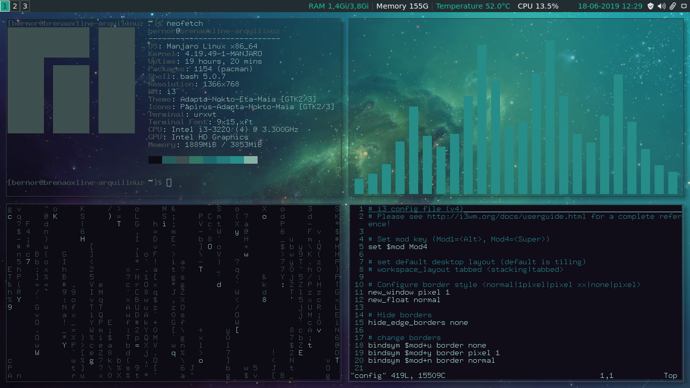
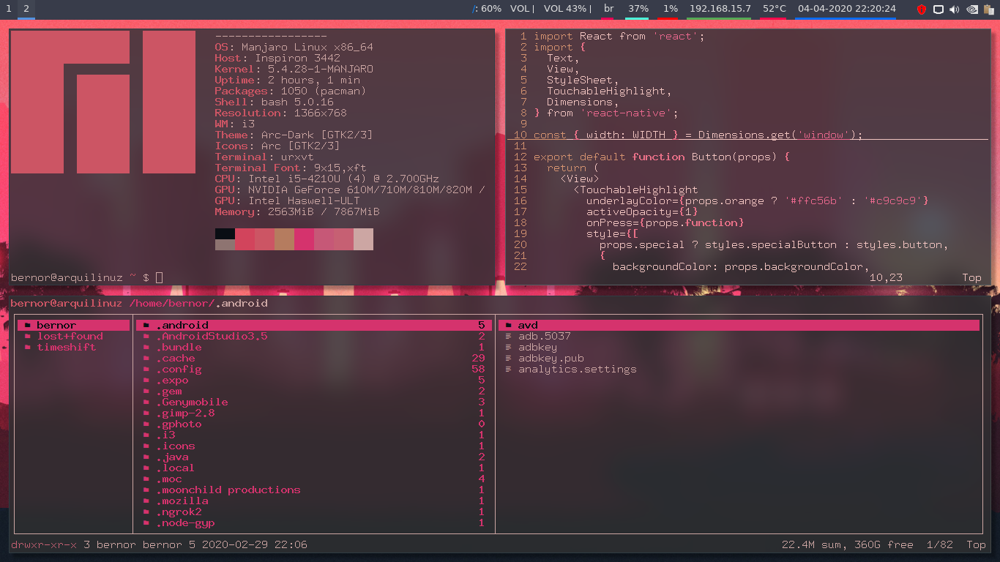

## Useful Software

This is a list of software I first install:

```
Pamac => Package Manager (enable AUR)
PS.: run this to get the fastest local mirrors:
$ sudo pacman-mirrors --fasttrack && sudo pacman -Syyu
Enable firewall => sudo ufw enable

Vivaldi with ffmpeg
Visual Studio Code
Timeshift (daily)
Steam
Transmission
LibreOffice
Genymotion (I'm a mobile dev)
Optimus-manager (Intel/Nvidia)

Polybar
Pywal

Configure lxappearance using Arc Dark theme
Set my dotfiles repository
```

## VSCode Settings:

BTW, check the dotfiles [here](https://github.com/brenobaptista/dotfiles).

```
Install Dracula Theme
Install Material Icon Theme
Install Fira Code
Install ESLint

{
    "workbench.colorTheme": "Dracula",
    "workbench.iconTheme": "material-icon-theme",
    "editor.fontFamily": "Fira Code",
    "editor.fontLigatures": true,
    "terminal.integrated.rendererType": "dom",
    "editor.fontSize": 16,
    "editor.detectIndentation": false,
    "editor.tabSize": 2,
    "window.menuBarVisibility": "default",
}
```

### Tip: If You've Encountered Some Problem, Check My Manjaro i3 Troubleshooting Guide:

[https://brenobaptista.github.io/blog/manjaro-i3-troubleshooting/](https://brenobaptista.github.io/blog/manjaro-i3-troubleshooting/)

### Screenshots:



