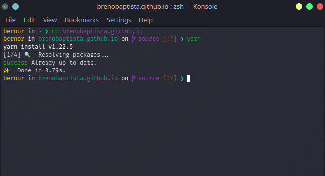
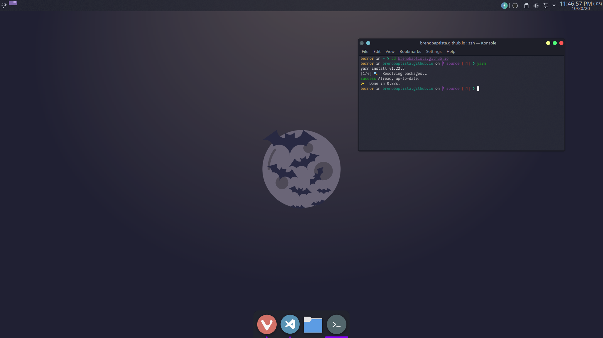

This guide is inspired by another guide made in Portuguese by Rocketseat. Check the guide [here](https://blog.rocketseat.com.br/terminal-com-oh-my-zsh-spaceship-dracula-e-mais/).

## Zsh

Z shell is an alternative to Bash.

[How to install Zsh](https://github.com/ohmyzsh/ohmyzsh/wiki/Installing-ZSH)

## Oh My Zsh

Oh My Zsh is a framework for managing your zsh configuration.

[How to install Oh My Zsh](https://github.com/ohmyzsh/ohmyzsh)

## Dracula

Dracula is a popular dark theme that can be used in a lot of editors. Use it in your terminal because it's a nice color palette.

[How to integrate Dracula into your terminal](https://draculatheme.com)

## Fira Code

Fira Code is a free monospaced font with programming ligatures.

[How to install Fira Code into your OS](https://github.com/tonsky/FiraCode/releases)

## Spaceship Zsh

Spaceship is a minimalistic, powerful and extremely customizable Zsh prompt.

[How to install Spaceship](https://github.com/denysdovhan/spaceship-prompt)

## Additional Configuration

### Setup Spaceship

At the end of `~./zshrc`, place this:

```
SPACESHIP_PROMPT_ORDER=(
  user          # Username section
  dir           # Current directory section
  host          # Hostname section
  git           # Git section (git_branch + git_status)
  hg            # Mercurial section (hg_branch  + hg_status)
  exec_time     # Execution time
  line_sep      # Line break
  vi_mode       # Vi-mode indicator
  jobs          # Background jobs indicator
  exit_code     # Exit code section
  char          # Prompt character
)
SPACESHIP_USER_SHOW=always
SPACESHIP_PROMPT_ADD_NEWLINE=false
SPACESHIP_PROMPT_SEPARATE_LINE=false
SPACESHIP_CHAR_SYMBOL="❯"
SPACESHIP_CHAR_SUFFIX=" "
```

### Zinit and Zsh plugins

[How to install Zinit](https://github.com/zdharma/zinit)

After installing Zinit:

At the end of `~./zshrc`, after `### End of ZInit's installer chunk`, add this:

```
zinit light zdharma/fast-syntax-highlighting
zinit light zsh-users/zsh-autosuggestions
zinit light zsh-users/zsh-completions
```

It will install 3 very useful plugins.

### VSCode terminal

Add this to your VSCode configuration:

`"terminal.integrated.shell.osx": "usr/bin/zsh"`

`usr/bin/zsh` is the path to your zsh. Run `which zsh` to get the path in your terminal.

## Bonus Tip

If you use yarn and you would like to have emojis in your terminal, run this in your brand-new terminal:

`yarn config set -- --emoji true`

## Screenshots




